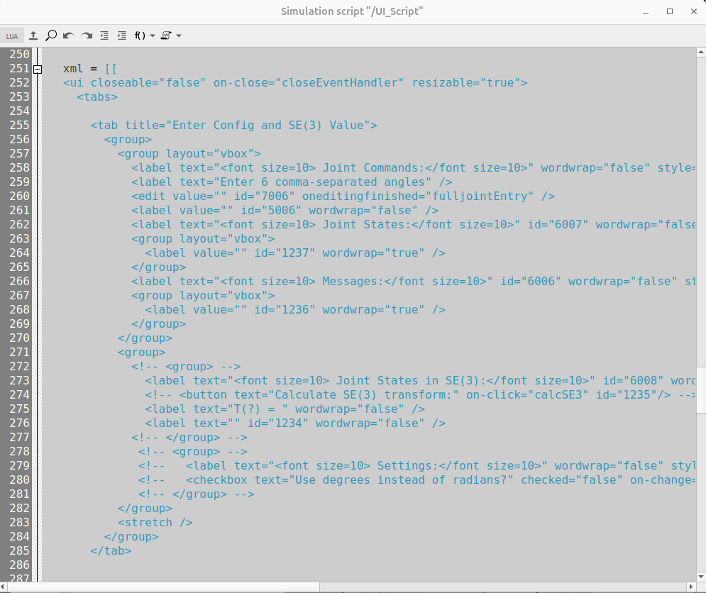
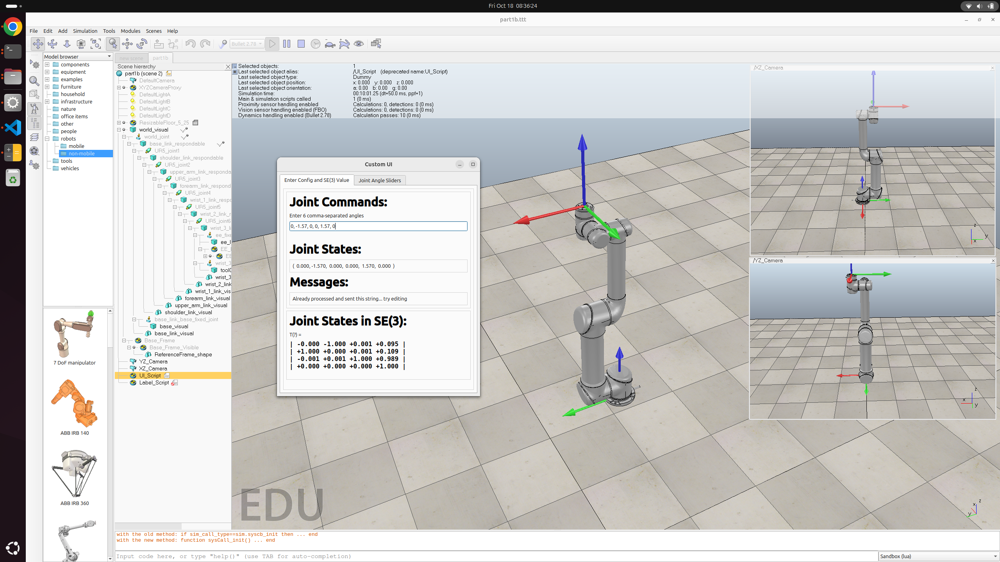

# Assignment 1
## 0. Part 1A

https://github.com/user-attachments/assets/e4758fe9-caa0-4d67-bfb2-1ca1ed9df98e

## 1. Part 1B
I have changed the UI_Script with specific modifications:


* line 258: Changed the words to **Joint Commands**, and changed the font to **\<font size=10>**
```xml
<label text="<font size=10> Joint Commands:</font size=10>" wordwrap="false" style="font-weight: bold;"/>
```
* line 262: Changed the words to **Joint States**, and changed the font to **\<font size=10>**
```xml
<label text="<font size=10> Joint States:</font size=10>" id="6007" wordwrap="false" style="font-weight: bold;"/>
```
* line 266: Changed the font to **\<font size=10>**
```xml
<label text="<font size=10> Messages:</font size=10>" id="6006" wordwrap="false" style="font-weight: bold;"/>
```
* line 273: Changed the words to **Joint States in SE(3):**, and changed the font to **\<font size=10>**
```xml
<label text="<font size=10> Joint States in SE(3):</font size=10>" id="6008" wordwrap="false" style="font-weight: bold;"/>
```

## 2. Part 1B and Part 2
The screenshot of the scene, clearly showing the modified UI, the SE(3) calculation, and the robot at the correct configuration:


## 3. Part 2
### 3.1. The list of the six joint angles (in radians):
```python
[-2.969495704644182, -0.7853926894212007, -1.5707963267948966, -0.8726096667837093, 0.15703168686324107, 2.191719725440599e-05]
```

###  3.2. $R_{sb}$:
```python
[[-0.942 -0.086  0.325]
 [-0.325 -0.015 -0.946]
 [ 0.086 -0.996 -0.014]]
```

###  3.3. Explaination of my method:
#### 3.3.1. Calculating $R_{sb}$:
Unknown matrices $R$ between different frames are calculated based on known relations between them, such as calculating unknown $R_{s1}$ with known $R_{s2}$ and $R_{12}$ using matrix inversion (or transpose). Then $R_{sb}$ is calculated by multiplying all the intermediate rotation matrices.

#### 3.3.2. Calculating Joint Angles $\theta$:
Joint angles are calculated with modern_robotics library. For every rotation matrix $R_i$, I used ```modern_robotics.MatrixLog3()``` to compute the logarithm of the rotation matrix to extract $[\hat\omega_i]\theta_i$, which is then converted to a vector form using ```modern_robotics.so3ToVec()```. This gives the product of the rotation axis $\hat\omega_i$ and the angle $\theta_i$. The $\hat\omega_i$ is already given by assignment instructions, thus we can directly calculate the $\theta_i$, which is a scalar.

###  3.4. Detailed implementation code
```python
import numpy as np
import modern_robotics as mr


# Known values
w_1 = np.array([0, 0, 1])
w_2 = np.array([0, 1, 0])
w_3 = np.array([0, 1, 0])
w_4 = np.array([0, 1, 0])
w_5 = np.array([0, 0, -1])
w_6 = np.array([0, 1, 0])

R_13 = np.array([[-0.7071, 0, -0.7071], [0, 1, 0], [0.7071, 0, -0.7071]])
R_s2 = np.array([[-0.6964, 0.1736, 0.6964], [-0.1228, -0.9848, 0.1228], [0.7071, 0, 0.7071]])
R_25 = np.array([[-0.7566, -0.1198, -0.6428], [-0.1564, 0.9877, 0], [0.6348, 0.1005, -0.7661]])
R_12 = np.array([[0.7071, 0, -0.7071], [0, 1, 0], [0.7071, 0, 0.7071]])
R_34 = np.array([[0.6428, 0, -0.7660], [0, 1, 0], [0.7660, 0, 0.6428]])
R_s6 = np.array([[0.9418, 0.3249, -0.0859], [0.3249, -0.9456, -0.0151], [-0.0861, -0.0136, -0.9962]])
R_6b = np.array([[-1, 0, 0], [0, 0, 1], [0, 1, 0]])


class Part2:
    """
    Class to calculate the forward kinematics of the robot    
    """
    def __init__(self):
        # Initialize the forward kinematics R matrices
        self.R = []
        self._init_R_with_known_values()
        
        # Initialize the w vectors
        self.w = []
        self._init_w_with_known_values()
        
    
    def _init_w_with_known_values(self):
        """
        Initialize the w vectors
        """
        self.w = [w_1, w_2, w_3, w_4, w_5, w_6]
        
        
    def _init_R_with_known_values(self):
        """
        Initialize the forward kinematics R matrices with the known values
        """
        # R_s1: R_s1*R_12 = R_s2
        R_s1 = R_s2 @ np.linalg.inv(R_12)

        # R_12 is already given

        # R_23: R_12*R_23 = R_13
        R_23 = np.linalg.inv(R_12) @ R_13

        # R_34 is already given

        # R_45: R_25 = R_23*R_34*R_45
        R_45 = np.linalg.inv(R_23 @ R_34) @ R_25

        # R_56: R_s6 = R_s1*R_12*R_23*R_34*R_45*R_56
        R_56 = np.linalg.inv(R_s1 @ R_12 @ R_23 @ R_34 @ R_45) @ R_s6

        # R_6b is already given
        
        # Store all the R matrices
        self.R = [R_s1, R_12, R_23, R_34, R_45, R_56]
    
    
    def get_R_sb(self):
        """
        Get the R_sb matrix
        """
        R_s6 = self.R[0]
        for R in self.R[1:]:
            R_s6 = R_s6 @ R
        R_sb = R_s6 @ R_6b
        return R_sb
    
    
    def R_to_theta(self):
        """
        Calculate the theta values from the R matrices
        """
        theta_list = []
        for idx, R in enumerate(self.R):
            # find theta
            omega_hat_skew_dot_th = mr.MatrixLog3(R)
            omega_dot_th = mr.so3ToVec(omega_hat_skew_dot_th)
            omega = self.w[idx]
            theta = np.linalg.norm(omega_dot_th)
            theta_sign = np.sign(np.dot(omega_dot_th, omega))
            theta = theta_sign * theta
            theta_list.append(theta)
        return theta_list


if __name__ == "__main__":
    # Set numpy printing options
    np.set_printoptions(precision=3, suppress=True)
    
    # Calculate the results
    pt2 = Part2()
    
    # Get the theta values
    theta = pt2.R_to_theta()
    print(f"Theta values: \n{theta}\n")
    
    # Get the R_sb matrix
    R_sb = pt2.get_R_sb()
    print(f"R_sb: \n{R_sb}\n")
```

The execution results are:
```sh
Theta values: 
[-2.969495704644182, -0.7853926894212007, -1.5707963267948966, -0.8726096667837093, 0.15703168686324107, 2.191719725440599e-05]

R_sb: 
[[-0.942 -0.086  0.325]
 [-0.325 -0.015 -0.946]
 [ 0.086 -0.996 -0.014]]

```
